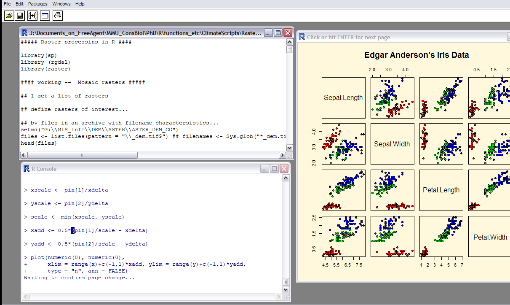
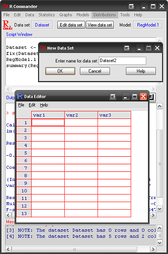

Una introducción a R
=======================================================
author: Christian Devenish
date: abril - junio 2014
autosize: true

**Herramientas para el análisis de datos de biodiversidad**

1.1 Introducción
===================================

- Estructura del curso

- ¿Qué es R? y ¿Por qué usarlo?

- ¿Cómo se usa R?

- Evaluación del curso

1.2 Estructura del curso
=================

- MODULO 1: Lenguaje y procesos básicos en R

- MODULO 2: Funciones estadísticas básicas en R

- MODULO 3: Pasos en un análisis de datos 

- MODULO 4: Mini proyecto  

- Textos (ver doc introductorio)

1.3 ¿Qué es R?
===========================
- Ambiente para análisis de datos y estadística
 - Manipulación de datos, archivos, análisis, automatización  

  
- Lenguaje de programación

- Software libre *open source*, "gratis"

- Programa de estadística más popular del mundo?
***


1.4 Popularidad de R
============================


<small>Google Scholar hits for software packages  
http://r4stats.com/articles/popularity</small>


1.5 ¿Por qué usar R?
============================

- Libre, rompe barreras en acceso a software para estadística
- Desempeño
- Comunidad grande
 - Apoyo (foros)
 - Paquetes (5391) y otro código compartido
 - Mayor cantidad de pruebas estadísticas, y otras aplicaciones
 - Documentación

- Reproducibilidad de investigación
- Para multiples plataformas (Windows, Mac, Linux, etc)

1.6 Paquetes contribuidos
===========================


<small>Exponential growth of contributed packages  
http://r4stats.com/articles/popularity/</small>

1.7 Cómo usar R
=======================

El "shell" básico



1.8 Cómo usar R
=================

Con un editor de texto, o IDE

***
O con un GUI
p.ej R Commander


1.9 Ventajas de RStudio (1)
========================================================

IDE - Integrated Development Environment (no GUI...)

- Facilita ver el script, los objetos, las páginas de ayuda, gráficos
- Organiza tus scripts con tabs, en "proyectos", con múltiples directorios de trabajo
- Algunas funciones comunes mas automatizados, p.ej. instalar paquetes, datos
- Autocompletar las funciones de R
- Sintaxis con colores
- Funciones de edición (buscar, reemplazar, etc)

1.10 Ventajas de RStudio (2)
=============================

- Visualizar los datos
- Debugging - ver donde tienes errores en tu script
- Integración con plataformas como Github para trabajos conjuntos o para compartir proyectos
- Hacer presentaciones como esta

Otros editores son [Tinn-R](http://nbcgib.uesc.br/lec/software/editores/tinn-r/en), [notepad++](http://www.notepad-plus-plus.org/), etc.


1.11 Evaluación del curso
==============================


```r
NF = As * 0.05 + Pa * 0.20 + Ej * 0.35 + Pr * 0.40
```
  
Donde:

- As <- Asistencia a clase
- Pa <- Participación en clase
- Ej <- Ejercicios
- Pr <- Proyecto

